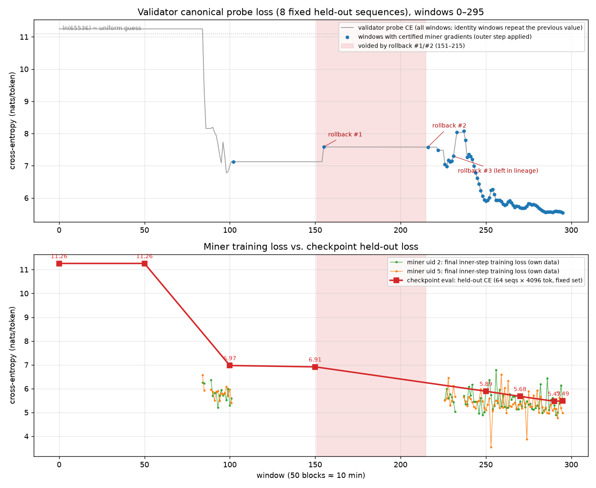

# MOK testnet 534 — training status report

*Generated 2026-08-21 01:23 UTC on the validator host (`shadecloud`, uid 0). Run `a100-test-1`, manifest `fc5b4943…`, overlay `configs/test_a100.yaml` (toy4L: 4 layers, hidden 1024, 16 experts top-4, vocab 65 536, seq 4096).*

## TL;DR

* **The model is learning.** From the seed-42 init to the latest checkpoint (w295) the held-out cross-entropy fell from **11.258 nats (ppl 77531, i.e. an untrained model — ln 65 536 = 11.09)** to **5.485 nats (ppl 241)** — a 5.77-nat improvement, ~322× lower perplexity. The validator's canonical probe agrees: 11.248 → 5.547.
* Progress came in two stints of real training: windows 85–102 (first miner cohort, 11.25 → ~7.0) and windows 222–295 (current cohort, 7.5 → 5.55). Everything in between was idle or voided by rollbacks.
* Over the last 20 evaluated windows the probe loss is still falling at ≈ 0.014 nats/window with both miners' gradients being certified every window, so the run has not plateaued.
* 70 of 296 windows carried certified miner gradients; 231 outer steps have been applied (void windows excluded). Actual tokens trained: uid 2 ≈ 66 M, uid 5 ≈ 66 M (819 200 tokens per miner-window on 1×A100, 81/81 windows reported).

## 1. Checkpoint evaluation (same data for every checkpoint)

Held-out set: 64 sequences × 4096 tokens drawn with a fixed seed from 61 cached `bulk` shards (independent of the PRF that assigns miner data; shard overlap with anything a miner trained on is ≈ 2 %). Probe set: the validator's canonical 8-sequence random pool (`PROBE_BLOCK_HASH` sentinel) — the numbers match the validator's logged `probe_loss` bit-for-bit, which also confirms the checkpoints re-load bitwise (every `state_root` verified).

| checkpoint | state_root | outer steps applied | held-out CE (nats) | held-out ppl | probe CE (nats) |
|---|---|---|---|---|---|
| w0 | `d71f8247572b…` | 0 | 11.2584 | 77531 | 11.2476 |
| w50 | `d71f8247572b…` | 51 | 11.2584 | 77531 | 11.2476 |
| w100 | `42d9b7a1249f…` | 101 | 6.9717 | 1066 | 7.0067 |
| w150 | `2ca0aa7380ed…` | 151 | 6.9148 | 1007 | 7.1250 |
| w250 | `8f7e11950752…` | 186 | 5.8907 | 362 | 5.8999 |
| w270 | `2960b3648a26…` | 206 | 5.6755 | 292 | 5.7038 |
| w290 | `1125b83703d0…` | 226 | 5.4713 | 238 | 5.5772 |
| w295 | `723b0d8d90f9…` | 231 | 5.4853 | 241 | 5.5471 |

Notes: w50 is byte-identical to the init (no miner had joined yet). w150 is the rollback target used twice; w250/w270/w290/w295 are the current lineage. Evaluated on the reference backend on this A100 (`flash_det`), bf16 masters, fp32 CE.

## 2. Run timeline (validator probe loss, 8 fixed sequences)

| windows | what happened | probe CE |
|---|---|---|
| 0–84 | run published; no miner online — identity windows | 11.248 |
| 85–102 | first cohort trains (uids 2, 5 onboarded at w84) | 9.333 → 7.125 |
| 103–154 | miners offline — identity windows (θ unchanged) | 7.125 |
| 155 | miners return; first real step trips the spike detector (+0.46 over a zero-spread baseline) → **rollback #1** to w150 | 7.583 |
| 151–215 | **voided** by the owner's amendment (rollback #1; leader hang + re-vote) | — |
| 216–217 | relaunch; the same first step re-trips the detector → **rollback #2** (no further amendment; lineage continues) | 7.579 |
| 222–231 | real training resumes; **rollback #3** fires on a +0.2 wobble at w231 (left in lineage, not amended) | 7.480 → 7.297 |
| 233–295 | validator relaunched with identity-window fix + dev threshold 1.0 nat; uninterrupted training | 8.037 → 5.547 |

The three rollbacks were detector false positives on toy-scale noise (documented in the code changes of 2026-08-20); since w233 training has been continuous.

## 3. Miner-side training loss (final inner-step loss, from their bucket telemetry)

| segment | uid 2 mean (n) | uid 5 mean (n) |
|---|---|---|
| w84–102 (first stint) | 5.803 (15) | 5.841 (15) |
| w222–231 | 5.662 (6) | 5.740 (6) |
| w286–295 (latest) | 5.486 (10) | 5.122 (10) |

Per-window training loss is noisy (each window is only 50 inner steps over 200 sequences), but it tracks the held-out curve: both miners now end their windows around 5.0–5.6 nats, consistent with the checkpoint CE of 5.49.

## 4. Caveats

* This is the **toy4L** configuration (≈190 M parameters, 16 experts) on 1-GPU miners, not the 54B target — numbers demonstrate the protocol pipeline end-to-end (train → commit → certify → replicated outer step → checkpoint), not model quality.
* Window-to-window probe swings of ±0.3–0.7 nats (e.g. w233: 8.04) are expected with outer lr 0.7 / momentum 0.9 at this scale; they are why the production spike threshold (0.15 nats) had to be overridden for the rehearsal.
* The validator's own weights are now landing on-chain (`set_weights accepted uids=[2, 5]`); incentive flips to uids 2/5 at the next Yuma epoch.

## 5. Reproducing the evaluation

1. Load a checkpoint's `model/` DCP dir with `C.core.checkpoint._dcp_load`, verify `hash_named_tensors(state) == meta.state_root`, `load_master_state` into `build_reference_model(cfg.model, 42, device="cuda")`.
2. Build batches from `/workspace/mok-cache/shards/bulk` via `ShardReader` (fixed seed 20260821 for the 64 held-out pairs; probe pairs from `EvalPools(world_size=8).random_pool(..., PROBE_BLOCK_HASH)`).
3. `mok_core.model.evaluate_sequences(model, batches, device="cuda")` → token-weighted CE; ppl = e^CE.
Sources: validator telemetry JSONL (`/data/mok-state/validator/telemetry/` + the older `/workspace/mok-state/...`), miner telemetry objects `telemetry/w*/uid*.json` in the miner buckets, checkpoints from `/data/mok-init`, `/data/mok-state/validator/checkpoints`, and the owner bucket (`checkpoints/w*/model.tar`).
